# 骑行辅助显示系统 CyclingAssistance 🚴🤝

“踏上设计它的路，比做出它更重要。”

[toc]

## 🔍️ 项目简介
基于STM32的骑行导航辅助显示设备。

## 👍 项目功能
本设备使用STM32F103RCT6作为主控，使用者可通过按键输入**中文**来设置导航目的地。系统能将目的地转换为经纬度坐标，同时通过读取GPS模块获取起始坐标，生成一条基于高德地图API的骑行导航路径。
本设备**不需要手机APP**，但仍需要手机开启热点功能提供Wifi。

## 👀 使用说明
下载字库步骤参照"软件设计->中文输入法->字库下载"。
设备启动时，GPS会进行搜星，此时正面"GPS"对应的LED灯不亮。搜星过程中**需保持静止，且上方无建筑物遮挡**（树木不影响GPS模块热启动）。

开机时设备进入输入法（前台应用inputmethod.app）。
屏幕上方显示<font color = #aa8800>已输入文字</font>，下方为候选项。
输入拼音时每行3项，输入文字时每行20项。通过移动<font color = #ff7777>光标</font>可选择需要输入的文字。
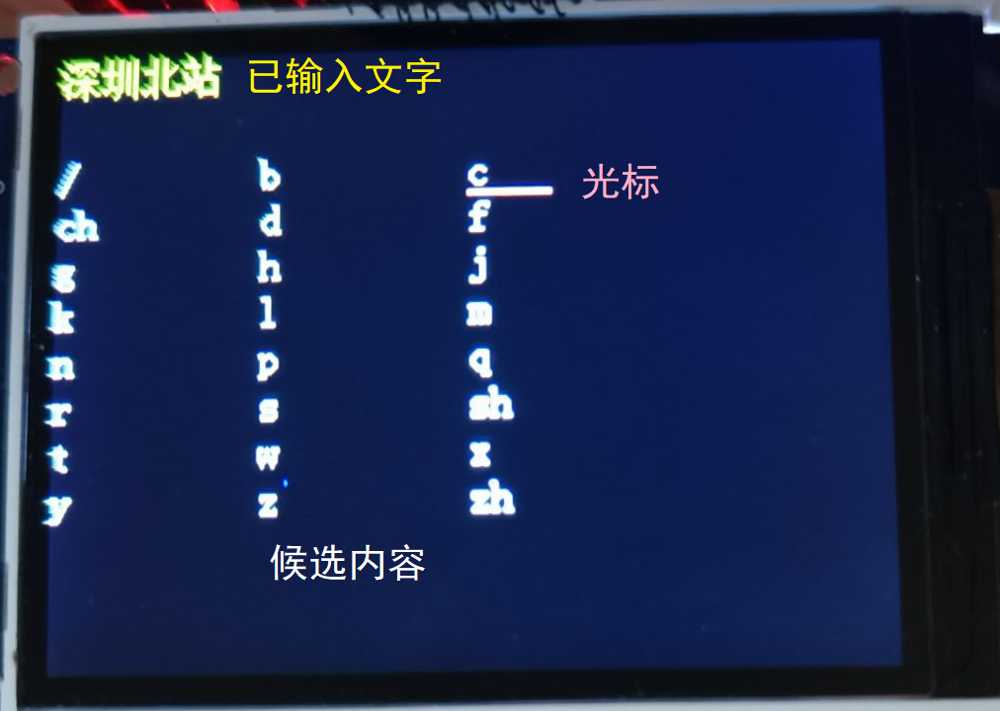
ASCII字符输入模式。
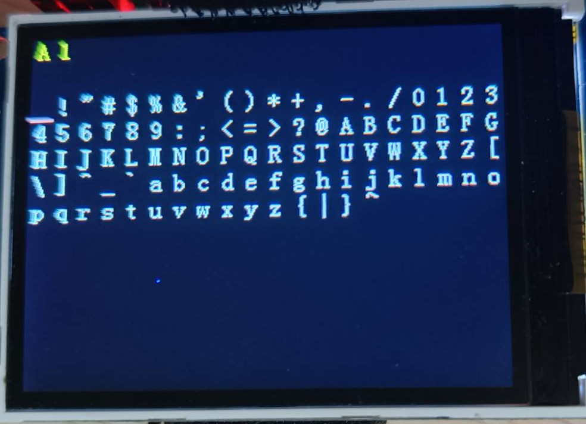
键位：
删除最后输入的文字/删除上一个选项 | <font color = #00aa00>光标上移</font> | / | 开始规划轨迹
-- | -- | -- | --
<font color = #aa00aa>光标左移</font> | 选择当前选项 | <font color = #aa3300>光标右移</font> | /
清空当前内容 | <font color = #00000aa>光标下移</font> | / | 切换地点/城市输入

“光标移动”定义如下图。
左/右移：选择前/后一个可行的选项。
上/下移：向上/下寻找一个可行的选项。若此列仅有当前一个可行选项，光标保持不动。
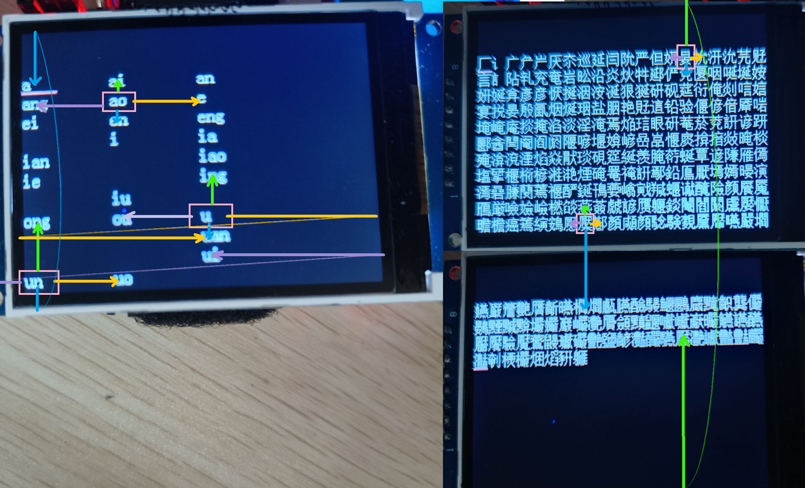
城市预设为广东（此参数可为省/市，也可为空），可使用输入法进行修改，或在代码中修改预设内容。
完成输入后，若**Wifi指示灯亮起**，可进行地址发送（若未连接Wifi时向ESP32发送信息，当Wifi连接后可能正常规划，也可能消息被覆盖）。
路径规划成功后，界面切换为路径显示（前台应用route.app）。

以下为GPS在线状态。
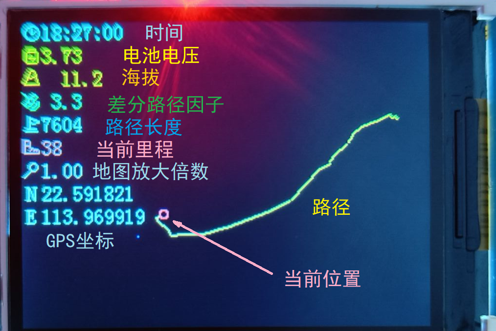
以下为GPS离线状态。
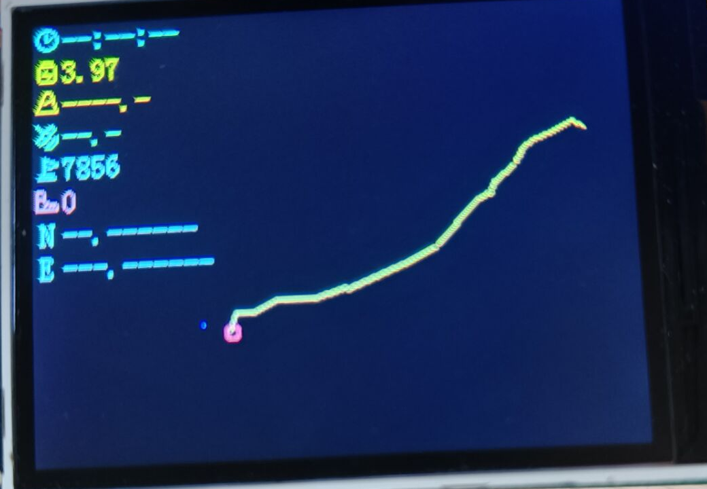
键位：
/ | 微调GPS定位 | 增大地图放大倍数 | /
-- | -- | -- | --
微调GPS定位 | 重新加载地图 | 微调GPS定位 | 返回输入界面
清空当前内容 | 微调GPS定位 | 减小地图放大倍数 | 切换地点/城市输入

微调GPS定位**仅在GPS离线时可用**，用于室内调试代码。
地图放大倍数为1~10，调整步长为1.26倍（2dB），重新加载地图后方可生效（改变后未加载，放大倍数显示为<font color=#c30000>红色</font>）。

在放置键盘时，建议FFC排线朝外，以便下一次取出键盘PCB。
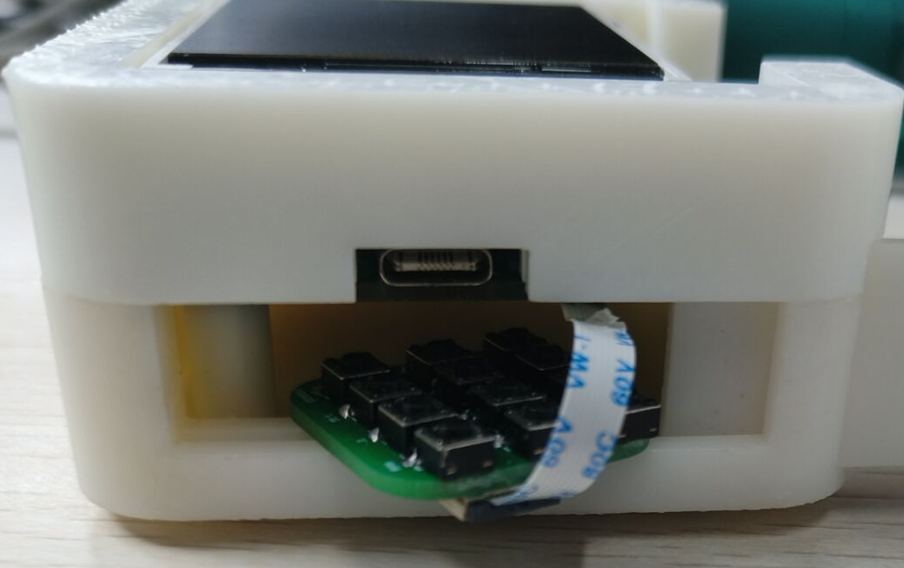


## 🛠️ 结构设计
<font color=#777777 size=2>~~*太🥬了不懂结构随便画的*~~</font>
装配图中半透明部分为3D打印外壳。
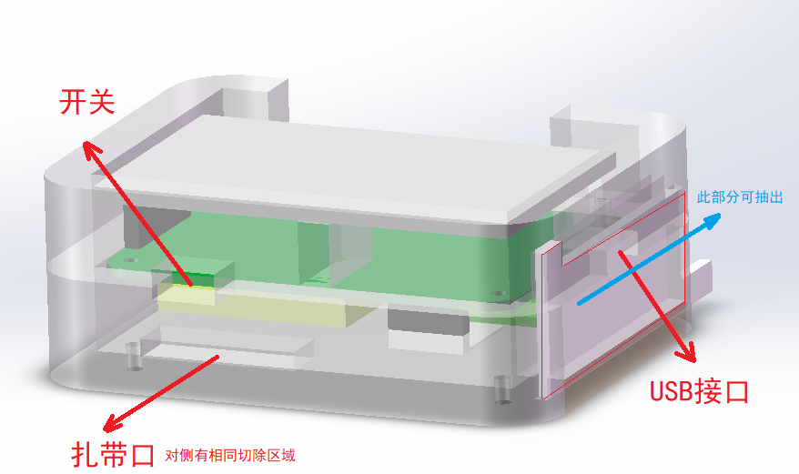
3D打印部分：
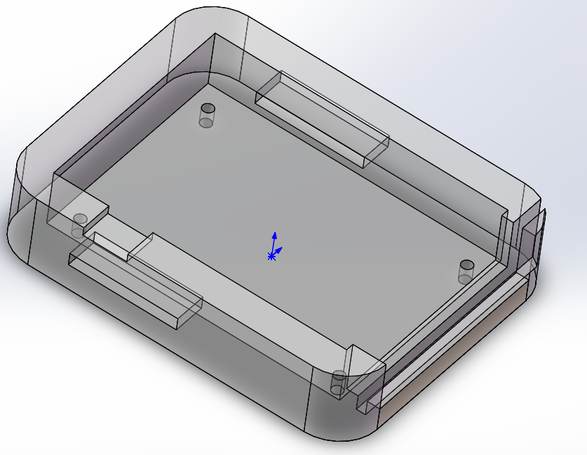
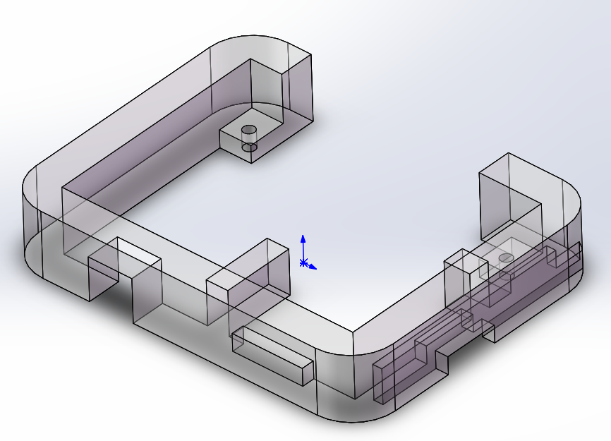
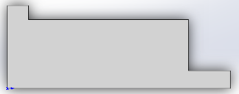

## ⚡ 硬件设计
PCB采用**立创EDA专业版**设计。
### 🔋 电源电路
#### 电池管理
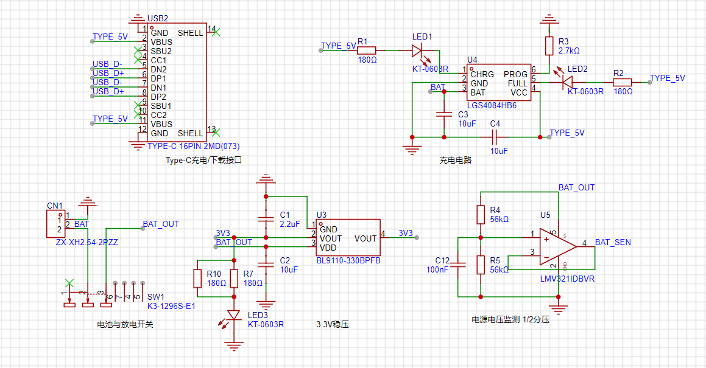
本设备采用3.7V锂电池供电，经线性稳压器BL9110-330BPFB输出3.3V。
锂电池充电电路参考[1]，使用LGS4084进行锂电池的充电管理。VCC(4脚)使用Type-C接口提供5V输入，并将BAT(3脚)连接锂电池。
在正常情况下，若电池已连接，正在充电时CHRG(1脚)输出低电平、FULL(5脚)输出高电平；充满电后CHRG输出高电平、FULL输出低电平。通过连接LED灯，可进行充电状态显示。
#### LED灯计算
LED为KT-0603R（红色），最大顺向电流I~F~为20mA，伏安特性曲线如下图（由于数据手册上I~F~并不是线性坐标，此图蓝色曲线为取值后拟合得到的结果）。
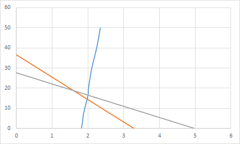
LED与电阻串联电路供电可能出现3.3V（通过IO控制）与5V（Type-C供电）两种情况。为方便起见，考虑两种情况下只使用一种型号电阻，不妨取5V供电时电阻为R，3.3V供电时为R/2。
经估算，取R=180Ω时，两种情况下LED电流均在14~17mA附近，电压约为2V。
#### 电压采样
使用运算放大器LMV321对电池电压进行采样。由于ADC测量范围为0~3.3V，因此电池电压需要经过分压后，再连接到ADC引脚。
运放电路采用电压跟随器结构，其中运放输出V~OUT~=V~BAT~/2。

### 🤖 STM32主控
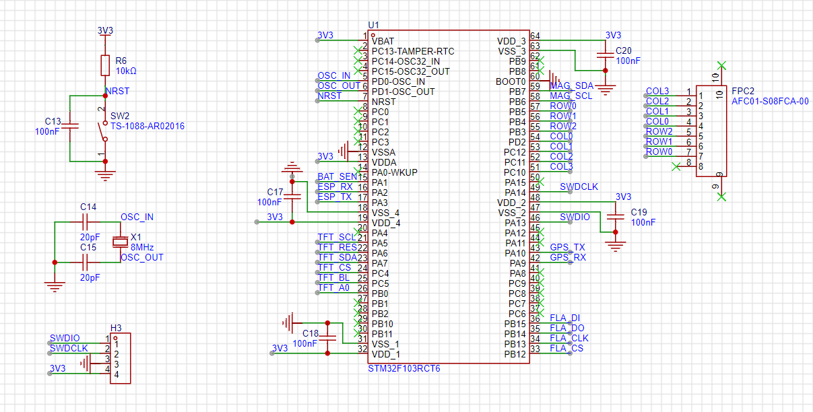
主控芯片采用STM32F103RCT6，晶振输入8MHz，经PLL倍频后主频为72Mhz,具有256KB Flash与48KB RAM。

### 💡 外设
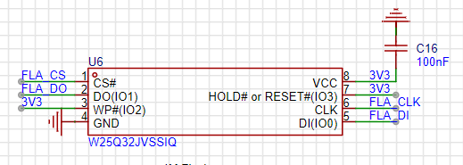
STM32内无法储存中文字库，因此采用外部Flash进行储存。
W25Qxx系列为Nor Flash，可通过SPI与STM32进行通信。W25Q32容量为4MB。

GPS模块采用ATGM336H成品模组，支持GPS、北斗等定位系统，通过串口发送数据。
模组供电后，若正在搜星，则模组上方LED灯常亮。搜星完成后，模组LED灯以1Hz频率闪烁，且PPS引脚以1Hz频率输出脉冲，以驱动PCB顶层的GPS LED灯闪烁。
此模块在使用时需连接天线，本项目采用陶瓷天线。

显示屏采用深圳金逸晨生产的2.4寸TFT屏(GMT024-8p10p-SPI VER1.1)，尺寸240*320像素，自带ST7789驱动，使用SPI通信。
若采用其它型号屏幕/底板，请自行修改排座引脚定义。

### 📶 Wifi模块

#### 主体电路
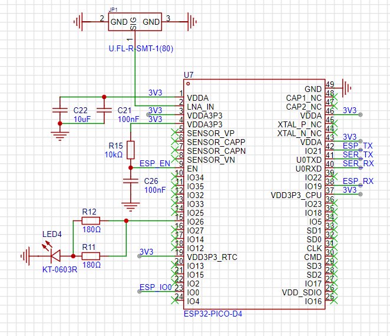
本设备通过ESP32 Pico-D4连接Wifi，其使用串口与STM32通信。

#### 下载电路
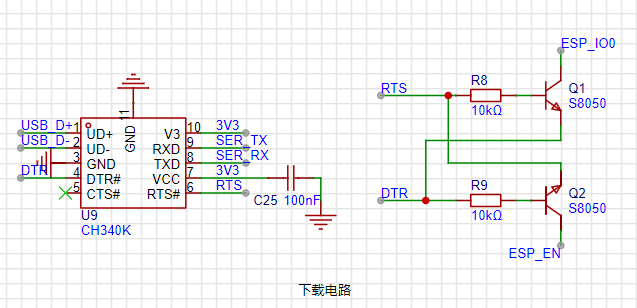
以上为ESP32的自动下载电路，USB转串口采用CH340K芯片。
ESP32进入下载模式时，需要先将IO0拉低，并将EN拉低后拉高以对芯片进行复位。重新启动时，通过检测IO0为低电平而进入下载模式。

IO0与EN默认为高电平。对三极管电路分析如下：
RTS电平 | DTR电平 | 分析
-- | -- | --
1 | 1 | Q1、Q2截止，IO0=EN=1
0 | 0 | Q1、Q2截止，IO0=EN=1
1 | 0 | Q1导通，Q2截止，IO0=0、EN=1
0 | 1 | Q2导通，Q1截止,IO0=1、EN=0

下载时，CH340先令DTR=1，RTS=0，使EN=0。
接下来令DTR=0，RTS=1，此时IO0=0。由于EN通过电容接地，因此存在一段时间内EN=0。电容充电完成后EN=1，ESP32进入下载模式。

### ⌨️ 矩阵键盘
矩阵键盘在另一块较小的PCB上，通过FFC排线与主PCB连接。
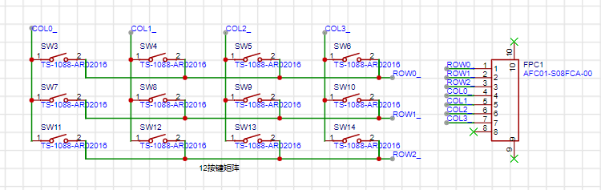
按键一端与同列按键并联，另一端与同行按键并联。

### 📈原理图
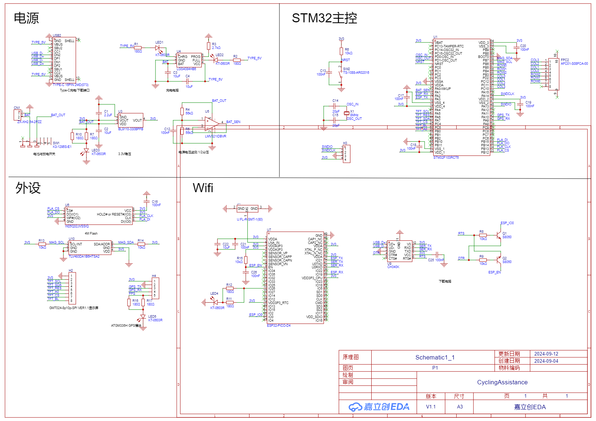
主PCB原理图，~~忽略EDA自带的A4框~~

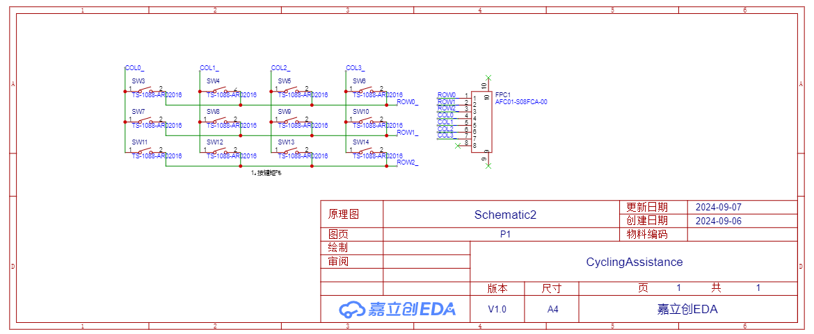
矩阵键盘原理图，空白部分进行了裁剪。

### 🀆 PCB
2层板。
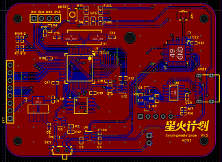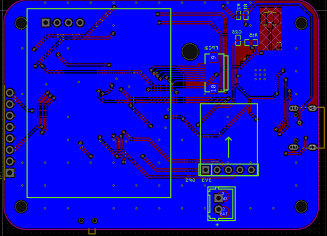
主PCB。
5Pin处丝印标示了GPS模块的安装方向（安装在底层），但后续不使用排座，并将模块安装在顶层，因此实际安装方向相反。
电池XH2.54接口处保留焊盘，可直接焊接电源与地线。
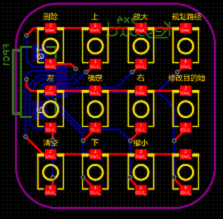
矩阵键盘PCB。

## 👨🏽‍💻 软件设计

### ✍ 主控代码

#### 总体框架
主控代码使用 STM32CubeMX 生成，基于 Makefile，在 VSCode 进行编译，使用 Ozone 调试。
代码参考[2]中的框架，采用HAL（Hardware Abstraction Layer）、APP（Application）两层结构，采用**面向对象**思想编写。
HAL层即硬件抽象层（不是HAL库），采用面向对象的方式，将显示屏、GPS等外设进行封装，提供APP层的函数接口。
HAL层中的一个外设，可能被多个APP层应用所使用。 
APP层即应用层，类似手机中的各个应用，通过调用HAL层封装好的各模块接口，实现更高级的功能。本设备中使用inputmethodapp（中文输入法）、routeapp（路线显示）两个模块。
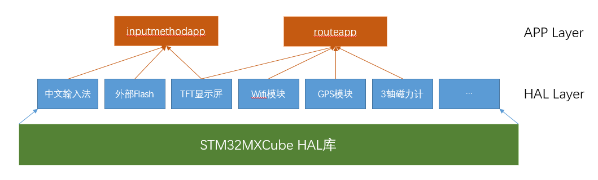

##### HAL层

HAL层采用面向对象的方式进行封装，对于每个模块创建一个结构体，储存使用到的GPIO、UART等接口，以及外设状态、缓冲区等变量，例如GPS模块的结构体定义：
```C
typedef struct gps_t
{
    UART_HandleTypeDef* huart;  // GPS通信使用的串口
    uint8_t rxbuf[GPS_BUFFER_LEN];  // 接收缓冲区
    GPS_Data data;  // 解析后的数据

    TIM_HandleTypeDef* watchdog_htim;  // 看门狗使用的tim
    uint8_t watchdog_count;  // 看门狗计数
}GPS;
```
模块初始化时，传入接口等数据，并在函数内部malloc一个对象实例，作为函数返回值。
```C
GPS *GPS_Init(UART_HandleTypeDef *huart, TIM_HandleTypeDef * htim){
    GPS *obj = (GPS *)malloc(sizeof(GPS));
    memset(obj, 0, sizeof(GPS));
    obj->huart = huart;
    obj->watchdog_htim = htim;
    /* 以下省略串口与tim初始化流程 */
    return obj;
}
```
在main.c中通过以下方式调用：
```C
GPS* gps;  // 全局变量
gps = GPS_Init(&huart1, &htim6);  // main()中, 进入while(1)前调用
```
在相关函数中传入初始化后的实例，实现模块的各种功能：
```C
void GPS_RxCallback(GPS *obj);
void GPS_Solve(GPS* obj);
```

##### APP层
APP层同样采用了面向对象的思想，但其结构体内包含HAL层封装的模块，同时也包括部分使用到的变量：
```C
typedef struct inputmethod_app_t{
    W25Q* w25q;  // 储存字库
    InputMethod* inputmethod;  // 输入法
    TFT* tft;  // 显示屏
    int16_t nowselect;  // 记录当前选定的下标
    int16_t lastselect;  // 上一时刻选定的下标, 用于优化屏幕刷新
    uint8_t nowflag;  // 为1时表示正在进行输入法操作, 此时相应按钮会对输入法进行操作
}InputMethodApp;
```
函数实现与HAL层类似。

主程序中使用foreground_app，表示当前的“前台应用”，同时只能有一个前台应用存在。该变量会影响按键中断执行的效果。

#### 中文输入法
##### 文字表示
所有汉字一共使用24个声母（包括无声母），33个韵母，对每个发音有至多364个汉字（不考虑声调）。
因此，可以用3个数据（声母，韵母，序号），表示一个唯一的汉字。

python的pinyin库可返回一个汉字的拼音，或分别获取其韵母、声母。
在unicode中，汉字的编码范围为0x4e00~0x9fa6，可通过遍历范围内的编码，访问所有汉字并按照发音分组。
尽管pinyin库可直接获取汉字的声母韵母，但部分拼音返回时与实际输入法存在差异（例如“研” yan会分别返回i an），因此采用返回整体发音的方式，若首字母不为a,o,e,i,u,v，则无声母；若前两个字符为zh,ch,sh，则判断为对应声母；否则，取首字母为声母。
对于韵母，部分汉字的$\ddot{u}$会在实际拼写中简化为u（例如“云” y$\ddot{u}$n -> yun），但调用函数时会返回yvn。为简化起见，将所有ve, vn合并到ue, un之内（33个韵母由此得到）。

##### 字库生成
生成字库时，需依次遍历Unicode中所有汉字（储存范围为0x4e00~0x9fa5），并按照发音，在24*33个list中寻找对应的分组（由于多音字的存在，一个汉字可能对应多个分组）。
事实上，遍历GB2312可减小使用的存储空间、提高生成速度，但实际地名存在部分生僻字，因此最终选择了汉字更全的Unicode。

所有汉字均完成分组后，将汉字按笔画数量排序，并计算每个分组的长度$sum_{i}$，并得到此分组之前所有分组的长度和$offset_{i}=\sum_{0}^{i-1} sum_{j}$，然后将各分组合并成一个list。
本设备中汉字的所有信息(unicode, 点阵)均按以下顺序存储。访问被编码为a,b,c的汉字时，其在以下序列中对应的下标为$offset_{33*a+b}+c$。当某个分组的$len_{i}$为0时，表示该发音实际上不存在对应汉字。
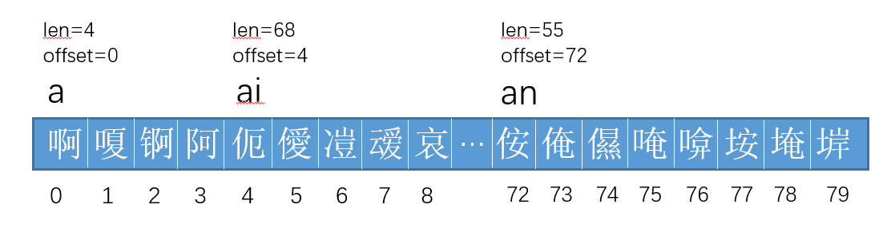
在显示屏上的输出可利用PIL库，将一个汉字转换为点阵图像，本设备设置图像大小为16*16，则一个汉字可使用32byte存储。

##### 输入法实现
输入法存在3个状态：待输入声母(0)、待输入韵母(1)、待输入序号(2)。待输入Ascii字符(3)。初始时输入法处于0状态，当前输入字符数为0。
Add操作：传入一个uint16_t code。
执行后，储存当前code，并切换为下一个状态。状态2,3下执行时，还会将当前已输入汉字数+1。
执行操作前需判断code合法性。0状态下，需满足$code0<24$；1状态下，需满足$code1<33$且$len_{33code0+code1}>0$；2状态下，需满足$len_{33code0+code1}>code2$；3状态下，需满足$code<95$。
对一个汉字，3个code通过以下方式存储：
```C
typedef struct character_t
{
    uint8_t initial;
    uint8_t final;
    uint16_t index;
}Character;
```
对Ascii字符，令code = 0xFF, 0xFF, (ascii-32)。

Delete操作：
状态0下执行，输出已输入最后一个汉字的所有code，已输入汉字数-1，执行结束后仍为0状态。
状态1,2,3下执行，删除上一次输入的code，切换为前一个状态。

下图中len指已输入汉字数。
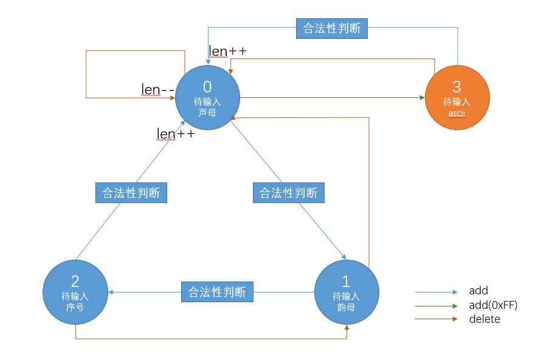

##### 如何存储汉字？
汉字的数量为27259（考虑多音字），每个字需要32byte空间存储，则需要850K空间进行存储，显然STM32F103RCT6并不能装下这么多内容。因此，设备采用了W25Q32作为Flash模块。
W25Qxx系列具有多种型号，其中W25Q32空间为4M。

芯片内部分为如下结构：
1块=16扇区=64K
1扇区=16页=4K
1页=256byte

芯片作为从机，通过SPI与主机通信，可参考[3]。
注意，执行0x02页写指令时，该指令不能跨页写（一次最多写256byte），且只能将1变为0。
因此，实际要在指定位置进行写操作时，需要计算出写区域所在的扇区，将扇区所有数据备份后清空。当要写的内容复制到备份区域之后，依次将16页内容重新写回Flash内。每次扇区擦除与页写时，均需要进行写使能。
使用Flash存储数据时，尽量让需要连续写入的数据在一个扇区内。

配置SPI时，建议波特率为4.5MBits/s（测试时使用spi2，PSC=8功能正常，PSC=4时部分数据不正确）。

##### 字库下载
Python生成的点阵如以下格式。由于此部分代码过长，因此采用临时生成的方式，下载完成后即可从STM32代码中删除。
每次下载1024个汉字的点阵，使用空间为32768byte。
```C
#if FONTTYPE == 0 
uint8_t fonttype[] = {
0,0,2,2,121,4,72,136,72,80,72,32,72,32,72,32,72,32,72,32,120,32,72,32,0,32,0,32,0,32,0,32,
0,0,0,0,123,254,72,8,72,8,73,232,73,40,73,40,73,40,73,40,121,232,73,40,0,8,0,8,0,40,0,16,
...
}；
#endif
#elif FONTTYPE == 1 
uint8_t fonttype[] = {
    ...
}
...
#elif FONTTYPE == 26
uint8_t fonttype[] = {
    ...
}
#endif
```
汉字对应unicode编码也以类似形式存储，但FONTTYPE的范围为30~31。
**需要下载字库时，将此代码放入inputmethodapp.c的**```uint32_t begin_addr = (FONTTYPE * 0x8000);```**语句之下。若未放入，开启字库下载(宏定义FONTTYPE)时，会报错变量"fonttype"不存在。**

#### 低通滤波器
代码将滤波器进行了模块化封装，目前支持1,2阶巴特沃斯低通滤波。
设信号采样频率为$f_s$，设计截止频率为$f_c$，则令$T=\frac{1}{f_s},\omega_c=2\pi f_c$。
1阶模拟滤波器传递函数为$H(s)=\frac{\omega_c}{s+\omega_c}$，利用双线性变换$s=\frac{2}{T}\frac{1-z^{-1}}{1+z^{-1}}$，得到数字滤波器$H(z)=\frac{T\omega_c(1+z^{-1})}{(\omega_cT+2)+(\omega_cT-2)z^{-1}}$。
但是看到这里，肯定有人发现问题了：使用双线性变换时频率会发生失真，所以在变换之前需要进行预畸变。
不妨从以下角度考虑：现在我们需要让数字频率为$\Omega_c=\omega_cT$，而现在得到的数字频率为$\Omega_c=2atan\frac{\omega_cT}{2}$。若数字频率为$\omega_cT$，则需找到一个对应的模拟频率$\omega_c'$。
利用$\omega_cT=2atan\frac{\omega_c'T}{2}$，可得到$\alpha=\omega_c'T=tan\frac{\pi f_c}{f_s}$。将此式代入$H(z)=\frac{T\omega_c'(1+z^{-1})}{(\omega_c'T+2)+(\omega_c'T-2)z^{-1}}$，得到一阶数字滤波器表达式$H(z)=\frac{\frac{\alpha}{\alpha+1}(1+z^{-1})}{1+\frac{\alpha-1}{\alpha+1}z^{-1}}$。
各项系数在scipy提供的低通滤波器中得到验证。类似地，可通过相同方式得到2阶滤波器的传递函数。

此事在《信号与系统》中亦有记载。

#### 按键
矩阵键盘共3行4列，其中行引脚输出低电平，列引脚为下降沿触发中断，开启上拉电阻。
当按下一个按键时，对应的列引脚被行引脚拉低，进入中断，得到按键所在列。此时依次拉高所有行引脚，若列引脚读取到高电平，则拉高的引脚为按键所在行。
通过此方式，m*n个按键仅需要m+n个引脚进行驱动，但同时只能按下一个按键。

列引脚拉高后需要恢复低电平，此步骤会导致中断再次触发，且被识别为某列0行的引脚（此代码中没有任何一行被识别到，now_key与列数相等）。
可修改stm32f1xx_hal_gpio.c中EXTI中断服务函数，调换清除中断标志位与回调函数的顺序解决：
```C
void HAL_GPIO_EXTI_IRQHandler(uint16_t GPIO_Pin)
{
  /* EXTI line interrupt detected */
  if (__HAL_GPIO_EXTI_GET_IT(GPIO_Pin) != 0x00u)
  {
    HAL_GPIO_EXTI_Callback(GPIO_Pin);
    __HAL_GPIO_EXTI_CLEAR_IT(GPIO_Pin);
  }
}
```
另一方面，为减少按下一次按键时执行多次指令（例如输入法选择输入时），代码限制中断触发频率为10Hz。

### ☁️ Wifi与网络连接
#### 使用ESP32访问Wifi
使用ESP32访问Wifi需要用到WiFi.h库。
ESP32代码提前储存了需访问的Wifi名称与密码（手机热点）。使用```WiFi.begin()```进行Wifi连接，可通过```WiFi.status()```判断是否连接成功。
若Wifi成功连接之后断开，进行重连时需先调用```WiFi.disconnect()```，再使用```WiFi.begin()```。
本代码每2s进行一次Wifi状态检测，若发现连接中断，则尝试重连直到连接成功为止。

#### URL格式
使用HTTPClient.h库访问URL。
众所周知，URL也就是统一资源定位符，用来表示互联网上资源的位置。URL一般形式如下：
<协议>://<主机>:<端口>/<路径><:参数><?查询>
例如 https://avatars.githubusercontent.com/u/98204082?v=4 ，访问可得到一张图片。
协议为https（一般为http/https）。
主机即域名 avatars.githubusercontent.com。
端口一般为默认值而省略。
路径即该主机下，某个资源存放的位置，即以上的/u/98204082。
查询即给网页传递参数，使用?表示下文为参数，格式为"param=value"，多个参数之间以&分隔。

使用URL传输参数时可利用转义，将一个字符基于utf-8编码表示成"%xx%xx"的形式。
例如：%48 = H，%E6%B7%B1%E5%9C%B3 = 深圳

#### 访问URL
以下不对HTTP请求报文等内容进行展开，仅讲解ESP32中代码的编写。
将需要访问的URL拼接到一个字符串（可使用转义）之后，建立一个HTTPClient，并使用```HTTPClient.GET()```发送HTTP请求。
成功时**返回值>0**，可使用```HTTPClient.getString()```获取返回内容。若访问失败，可通过```HTTPClient.errorToString(httpCode)```输出错误信息（httpCode为```HTTPClient.GET()```返回值）。

#### 解析Json
Json解析并不需要手搓，使用ArduinoJson.h即可。
使用```DynamicJsonDocument doc(16384)```创建一个保存Json信息的对象（长度可以适当设大一些，尽管实际可能也用不到16384）。
使用HTTP请求资源，一般返回内容采用Json格式。若返回字符串为payload，则使用```deserializeJson(doc, payload)```可自动对其内容进行解析，然后将解析后的信息储存在doc之中，符合Json的层次结构。
可按照类似访问数组的方式，访问键值下的指定内容。
若该内容不存在，则返回null。
例如，访问以下内容时，```doc["route"][0][1]```的结果为22.582009。
```json
{
    "status": 0, 
    "distance": 7856, 
    "route": [[113.965347, 22.582009], [114.025245, 22.613978]], 
    "center": [113.995296, 22.598451], 
    "halfside": 0.029949
}
```

### 🌏️ 路径规划
这个更是重量级。

#### 高德地图API
使用高德地图API时，需要注册高德地图开发者账号，并创建Key（每种LBS服务每日5000次调用），创建步骤与API功能见https://lbs.amap.com。

需要注意的一点是，地理坐标系统存在多种。
WGS-84（下称W系），是GPS、北斗等各种定位模块使用的坐标系，对应地球上**真实经纬度**。
但是，各国家出于安全考虑，在进行测绘时，会相对于W系进行一定的**偏移加密**。中国国家测绘局制定的地理坐标系统为**GCJ-02**（下称G系），与W系存在几百米的误差。G系的加密算法未公开，不过好在W系和G系的坐标能够一一对应上，且目前已能实现较高精度的坐标系转换（算法见[5]）。
国内除百度地图使用自己的BD-09以外，几乎所有电子地图系统均采用G系（包括高德地图）。因此调用高德地图API时，需要将GPS发送的真实坐标转换成G系之后再传参。

#### GPS模块
无论是ATGM336H，还是NEO-6M等模块，绝大多数GPS设备都采用NMEA-0183协议发送GPS信息，其一次会发送多条形如```$GPxxx,<0>,<1>,...,<n>*xx\r\n```的语句，不同地址域（"GPxxx"/"BDxxx"）对应不同内容，其中GPGGA对应GPS定位信息。
<font size=1>*（其实较多教程使用的是推荐定位信息GPRMC，但本人使用时发现有时候不发GPRMC，但每次一定会发GPGGA/GNGGA，所以就用这个了）*</font>

基本格式如下：
参数序号 | 内容
-- | --
**0** | UTC时间（hhmmss格式，北京时间需要在此基础上+8h）
**1** | 纬度（ddmm.mmmmm，传输前面的0，**度分格式，注意转换成小数格式**）
**2** | N/S，北/南半球
**3** | 经度（dddmm.mmmmm）
**4** | E/W，东/西半球
**5** | 为0时未定位
6 | 正在使用的卫星数量（00-12）
**7** | 水平精度因子（0.5-99.9，越小越好）
**8** | 海拔高度（-9999.9-99999.9）
9 | M，表示单位m
10 | 地球椭球面相对大地水准面的高度
11 | M
12 | 差分时间
13 | 差分站ID号

标号加粗表示本设备使用此内容，末尾的*xx为校验码。
ATGM336H在以上内容的基础上，还会发送地址域为GPTXT的内容表示天线状态。天线正常、短路、开路时，可在语句中分别找到"OK","SHORT","OPEN"的字段。天线短路也可能导致模块通电但LED灯不亮，可辅助判断。

#### 搭建远程平台
路径规划、轨迹简化等一系列操作需要较高算力，在ESP32上不便操作。因此，本设备借助远程平台，在云端执行复杂的运算处理后，通过HTTP读取最终的结果。
**函数工作流FunctionGraph**是华为云推出的一款无服务器计算服务，用户自行编写相关函数，客户端通过HTTP等方式访问即可执行代码。

总览->创建函数，选择函数类型为HTTP函数。
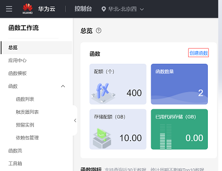


进入函数，创建触发器，选择API网关服务，使此函数能通过HTTP调用。方便起见，安全认证可选择None，其它配置默认即可。
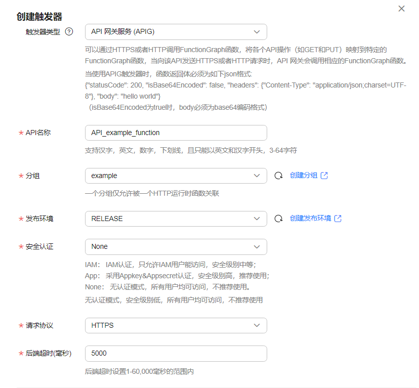


（此步骤可选）
进入API管理页面，编辑当前API。第2步，修改当前请求Path并发布API，便于管理。

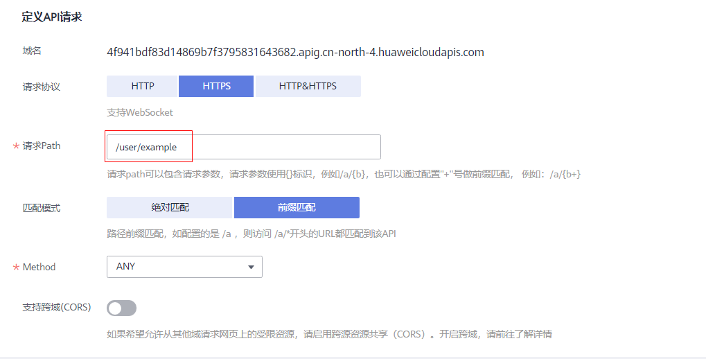

进入该函数的“设置”界面，可通过“调用URL”下的路径进行函数调用。
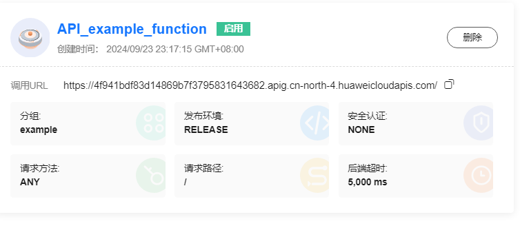

创建完成后，开始编写代码。FunctionGraph不支持C/C++，但可以使用Python。以Python为例，将代码文件重命名为 input.py，bootstrap内容改为```/opt/function/runtime/python3.9/rtsp/python/bin/python3 $RUNTIME_CODE_ROOT/index.py```。

以下为Python代码模板：
```Python
import socketserver
import http.server
from urllib.parse import parse_qs, urlparse
import json
import requests

PORT = 8000

class SimpleHTTPRequestHandler(http.server.SimpleHTTPRequestHandler):
    def do_GET(self):
        self.send_response(200)
        self.send_header('Content-type', 'text/html')
        self.end_headers()

        # 在以下位置补充自己的代码
        params = parse_qs(urlparse(self.path).query)
        str = params["str"]

        # 返回同样为Json格式的字符串
        message = {
            "status": 0,
            "reply": str
        }
        self.wfile.write(json.dumps(message).encode())

with socketserver.TCPServer(('127.0.0.1', PORT), SimpleHTTPRequestHandler) as httpd:
    print('Python web server at port 8000 is running..')
    httpd.serve_forever()
```

为验证代码编写是否正确，可自行配置测试事件。选择事件模板为API网关服务(APIG)，在pathParameters下填写传入的参数，例如：
```json
"pathParameters": {
    "str" : "HelloWorld"
},
```


测试完成后，通过HTTP访问该函数。网页显示```{"status": 0, "reply": ["HelloWorld"]}```，调用成功。

#### 路径规划与简化
如果直接调用高德地图API，返回的路径是这样的：（大学城地铁站->深圳北站）
```json
{"data":{"destination":"114.030865,22.610815","origin":"113.965307,22.581946","paths":[{"distance":8100,"duration":1944,"steps":[{"action":"向左前方行驶","assistant_action":"","distance":4421,"duration":1061,"instruction":"沿留仙大道向东骑行4421米向左前方行驶","orientation":"东","polyline":"113.965334,22.581858;113.965339,22.581858;113.965503,22.581914;113.965503,22.581914;113.966259,22.582105;113.966259,22.582105;113.96668,22.582218;113.967114,22.582296;113.967374,22.582322;113.967648,22.582335;113.968008,22.582335;113.968008,22.582335;113.968299,22.582331;113.968299,22.582331;113.968845,22.582292;113.968845,22.582292;113.969128,22.582274;113.969128,22.582274;113.969549,22.582244;113.969549,22.582244;113.97,22.582218;113.97,22.582218;113.971059,22.582153;113.971059,22.582153;113.971181,22.582148;113.971181,22.582148;113.971363,22.582131;113.972357,22.58207;113.972639,22.582066;113.97299,22.582083;113.97299,22.582083;113.973325,22.582127;113.973455,22.582153;113.973594,22.582187;113.97385,22.582257;113.974119,22.582348;113.974371,22.582452;113.974614,22.582578;113.975226,22.582908;113.975516,22.58306;113.975516,22.58306;113.975547,22.583082;113.976042,22.583355;113.976745,22.58372;113.976745,22.58372;113.976845,22.583763;113.976845,22.583763;113.977088,22.583867;113.977318,22.583937;113.977318,22.583937;113.977574,22.583997;113.977574,22.583997;113.977904,22.584076;113.978125,22.584102;113.978407,22.584119;113.978702,22.584123;113.979583,22.584115;113.979583,22.584115;113.979848,22.584049;113.980017,22.584023;113.980208,22.584002;113.980846,22.583911;113.981189,22.583889;113.982114,22.583893;113.982817,22.583885;113.982817,22.583885;113.982908,22.583889;113.982908,22.583889;113.983077,22.583898;113.983902,22.58398;113.98444,22.584045;113.984883,22.584171;113.984883,22.584171;113.985525,22.584249;113.98589,22.584323;113.986202,22.584392;113.986602,22.584492;113.986602,22.584492;113.986936,22.584588;113.987279,22.584701;113.987843,22.584909;113.987843,22.584909;113.988225,22.585061;113.988225,22.585061;113.988312,22.585087;113.988312,22.585087;113.988676,22.585226;113.988676,22.585226;113.98901,22.585356;113.98901,22.585356;113.989431,22.585516;113.989431,22.585516;113.989683,22.585464;113.990104,22.585621;113.990104,22.585621;113.991332,22.586085;113.991332,22.586085;113.99178,22.586263;113.99178,22.586263;113.991849,22.586289;113.991849,22.586289;113.99191,22.586311;113.99191,22.586311;113.991949,22.586328;113.991949,22.586328;113.992804,22.586654;113.992804,22.586654;113.993299,22.586845;113.993299,22.586845;113.993993,22.587105;113.993993,22.587105;113.994054,22.587127;113.994054,22.587127;113.994757,22.587396;113.994757,22.587396;113.995139,22.587539;113.995139,22.587539;113.995373,22.587626;113.995373,22.587626;113.996189,22.587934;113.996189,22.587934;113.997036,22.58826;113.997036,22.58826;113.997283,22.588351;113.997283,22.588351;113.997656,22.588485;113.997656,22.588485;113.998503,22.588885;113.998503,22.588885;113.999158,22.589175;113.99921,22.589214;113.99921,22.589214;113.999371,22.589332;113.999371,22.589332;113.999579,22.589423;113.999579,22.589423;113.999601,22.589431;113.999601,22.589431;114.000126,22.589627;114.000126,22.589627;114.000655,22.589818;114.000677,22.589835;114.000677,22.589835;114.000729,22.589857;114.000729,22.589857;114.002266,22.590443;114.002769,22.590647;114.002804,22.590655;114.002804,22.590655;114.002921,22.590707;114.002921,22.590707;114.003307,22.590903;114.003707,22.591128;114.004184,22.591419;114.004657,22.591736;114.004944,22.591953;114.004944,22.591953;114.004996,22.591997;114.004996,22.591997;114.005339,22.592292;114.005612,22.592543;114.005803,22.592708","road":"留仙大道","walk_type":0},{"action":"向右前方行驶","assistant_action":"","distance":946,"duration":227,"instruction":"沿留仙大道向东北骑行946米向右前方行驶","orientation":"东北","polyline":"114.005803,22.592708;114.006042,22.592999;114.006042,22.592999;114.006215,22.59319;114.00674,22.593811;114.00674,22.593811;114.007665,22.594905;114.00829,22.595603;114.00829,22.595603;114.008984,22.596372;114.008984,22.596372;114.009036,22.596441;114.009036,22.596441;114.00987,22.597426;114.010243,22.59786;114.010412,22.598082;114.010412,22.598082;114.010556,22.598251;114.010556,22.598251;114.010703,22.598424;114.010703,22.598424;114.010937,22.598659;114.011024,22.598728;114.011024,22.598728;114.011115,22.598811;114.011714,22.599266","road":"留仙大道","walk_type":0},{"action":"左转","assistant_action":"","distance":273,"duration":66,"instruction":"向东北骑行273米左转","orientation":"东北","polyline":"114.011714,22.599266;114.012222,22.599431;114.012305,22.599497;114.012305,22.599497;114.012526,22.599661;114.012526,22.599661;114.013073,22.6;114.013312,22.600169;114.013511,22.600286;114.013511,22.600286;114.013542,22.600308;114.013633,22.600347;114.013676,22.600356;114.013737,22.60036;114.013854,22.600343;114.013937,22.600317;114.014019,22.600269","road":"","walk_type":0},{"action":"向左前方行驶","assistant_action":"","distance":72,"duration":17,"instruction":"向东北骑行72米向左前方行驶","orientation":"东北","polyline":"114.014019,22.600265;114.01454,22.600716","road":"","walk_type":0},{"action":"向右前方行驶","assistant_action":"","distance":1702,"duration":408,"instruction":"沿留仙大道向东北骑行1702米向右前方行驶","orientation":"东北","polyline":"114.01454,22.600716;114.014549,22.600851;114.014392,22.601042;114.014392,22.601181;114.015087,22.602248;114.015126,22.602452;114.015126,22.602452;114.015286,22.6027;114.015286,22.6027;114.015577,22.603038;114.015738,22.603199;114.015738,22.603199;114.016081,22.603503;114.016081,22.603503;114.016163,22.603576;114.016484,22.603815;114.016484,22.603815;114.016979,22.604132;114.017483,22.604427;114.017483,22.604427;114.017795,22.604627;114.018116,22.60487;114.018307,22.605056;114.018576,22.605343;114.018811,22.605681;114.019102,22.606185;114.019497,22.606936;114.019497,22.606936;114.019735,22.607357;114.020039,22.607821;114.020039,22.607821;114.020221,22.60796;114.02049,22.608242;114.020694,22.608446;114.020885,22.608615;114.021124,22.608798;114.021124,22.608798;114.021168,22.608837;114.021697,22.609175;114.021888,22.609253;114.022322,22.609453;114.022322,22.609453;114.023077,22.60967;114.023077,22.60967;114.023351,22.609744;114.023351,22.609744;114.023563,22.6098;114.023563,22.6098;114.024106,22.609957;114.024106,22.609957;114.024792,22.610182;114.025152,22.610321;114.025152,22.610321;114.025495,22.610573;114.025495,22.610573;114.025898,22.610742","road":"留仙大道","walk_type":0},{"action":"直行","assistant_action":null,"distance":246,"duration":59,"instruction":"向东北骑行246米直行","orientation":"东北","polyline":"114.025898,22.610742;114.025998,22.610734;114.027409,22.611458;114.02799,22.611788","road":"","walk_type":0},{"action":"向左后方行驶","assistant_action":"","distance":112,"duration":27,"instruction":"向东北骑行112米向左后方行驶","orientation":"东北","polyline":"114.02799,22.611788;114.028576,22.612118;114.028576,22.612118;114.028633,22.612075;114.028633,22.612075;114.028537,22.611984;114.028498,22.612023;114.028555,22.61207;114.028555,22.61207;114.02852,22.61214","road":"","walk_type":4},{"action":"左转","assistant_action":"","distance":31,"duration":7,"instruction":"沿留仙大道辅路向南骑行31米左转","orientation":"南","polyline":"114.028516,22.61214;114.028459,22.612066;114.028446,22.612018;114.028446,22.611966;114.028455,22.611879","road":"留仙大道辅路","walk_type":0},{"action":"左转","assistant_action":"","distance":83,"duration":20,"instruction":"沿新区大道辅路向东南骑行83米左转","orientation":"东南","polyline":"114.028455,22.611875;114.028989,22.611315","road":"新区大道辅路","walk_type":0},{"action":"右转","assistant_action":"","distance":51,"duration":12,"instruction":"向东北骑行51米右转","orientation":"东北","polyline":"114.028989,22.611311;114.029358,22.611619","road":"","walk_type":0},{"action":"左转","assistant_action":"","distance":100,"duration":24,"instruction":"向东南骑行100米左转","orientation":"东南","polyline":"114.029358,22.611619;114.029479,22.611484;114.029761,22.611189;114.029761,22.611189;114.029996,22.610951","road":"","walk_type":0},{"action":"右转","assistant_action":"","distance":43,"duration":10,"instruction":"向东北骑行43米右转","orientation":"东北","polyline":"114.029996,22.610946;114.030104,22.611029;114.030104,22.611029;114.030317,22.611207","road":"","walk_type":0},{"action":"左转","assistant_action":"到达目的地","distance":20,"duration":5,"instruction":"向东南骑行20米左转到达目的地","orientation":"东南","polyline":"114.030317,22.611207;114.030356,22.611133;114.030352,22.61112;114.030352,22.61112;114.030408,22.611094;114.030408,22.611094;114.03043,22.611072;114.03043,22.611072;114.03043,22.611072","road":"","walk_type":0}]}]},"errcode":0,"errdetail":null,"errmsg":"OK","ext":null}
```
~~仙之人兮列如麻~~
一条路径有很多段，一段又有如此多的点，而且一次规划可能有几条路径，这样的数据明显不能直接拿来用，这就是为什么需要使用云平台进行处理。
路径的一段是这种格式：
```json
{
    "action":"左转","assistant_action":"","distance":273,
    "duration":66,"instruction":"向东北骑行273米左转","orientation":"东北",
    "polyline":
    "114.011714,22.599266;114.012222,22.599431;114.012305,22.599497;
    114.012305,22.599497;114.012526,22.599661;114.012526,22.599661;
    114.013073,22.6;114.013312,22.600169;114.013511,22.600286;
    114.013511,22.600286;114.013542,22.600308;114.013633,22.600347;
    114.013676,22.600356;114.013737,22.60036;114.013854,22.600343;
    114.013937,22.600317;114.014019,22.600269",
    "road":"",
    "walk_type":0
}
```
一段会有多个路径点，且此段最后一点为下一段的起始点。由此，第一步是提取所有不重复的路径点，效果如下图（291个路径点）。
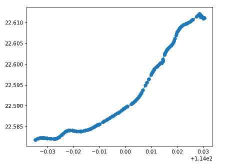
距离相近的点将会进行合并（代码中选取合并距离为20m）。另一方面，三个点之间会形成两条连线，若连线夹角小于15°，也进行合并。
合并后仅剩27个路径点。
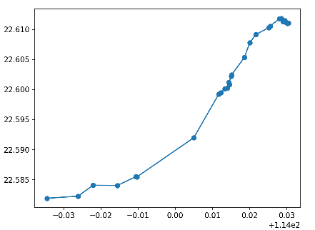
路径处理完成后，将所有路径点，以及高德地图API返回的路径长度、用时等信息发回ESP32，再由ESP32传递给STM32 。
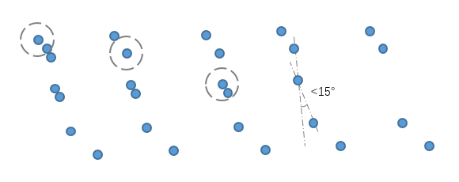

#### 里程计算
由于GPS模块本身精度有限，里程计算可能不会特别精确。
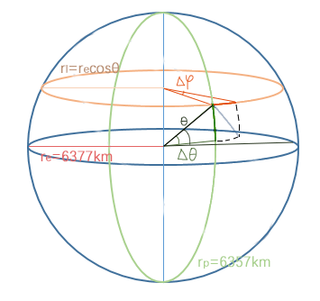
GPS有效的1s内若经度不变，纬度变化为$\Delta\theta$，则此路径弧长为$\Delta y=r_{p}\Delta\theta$。
若当前纬度为$\theta$且保持不变，经度变化为$\Delta\phi$，则此路径弧长为$\Delta x=r_{l}\Delta\phi=r_{e}\Delta\phi cos\theta$。
由于$\Delta\theta$与$\Delta\phi$均极小，可将移动范围近似为平面，则取1s内位移$\Delta s = \sqrt{\Delta\theta^2 + \Delta\phi^2}$。

## 🙏 展望
外壳下半部分由于存在高度突变，键盘PCB可能会较难取出。
或可将边缘与底部通过斜面过渡（如下图），或是边缘部分与底部等高，再在此基础上切槽。
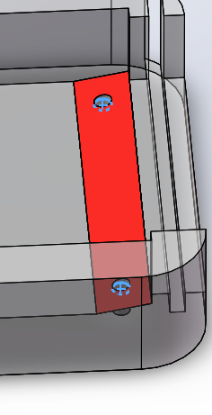

TFT屏目前使用8pin排座连接，可换为不自带底板，直接在PCB上绘制焊盘进行连接，减小设备总体厚度。
以下原理图为商家提供资料。
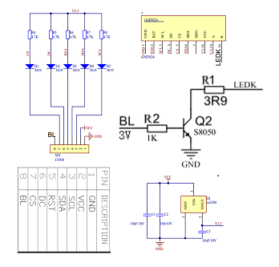
此设备主PCB与键盘矩阵的引脚对应关系反向（上传的原理图似乎改了），可将键盘矩阵为4*4，FPC连接器上所有引脚均使用，可通过修改STM32的GPIO定义修正方向。

STM32所用晶振可尝试选用体积更小的封装。

可尝试使用蜂鸣器，提示当前需要转向，或电量过低。

## ⚠️ 注意！
STM32小心引脚虚焊。与此同时，芯片1脚并不位于表面印刷文字的左上角，1脚位置以较小圆为准。

项目开始采用成品ESP8285模块作为Wifi模块，但下载代码时导致电脑蓝屏，推测原因为ESP8285（包括ESP8266等）瞬时电流过大，或是下载器接触不良导致频繁上下电。
<font color=#777777 size=1>*若电脑蓝屏后重启，屏幕不亮且一直报警，可尝试将电脑电源线断开后按开机键30s释放静电，本人这么做了3次有效(ThinkPad E14 Gen2)*</font>
因此，最终选用ESP32 Pico-D4作为Wifi模块。

ESP32焊接时，GND焊盘上不能带有过多锡，否则会导致芯片整体被抬起，1-48引脚与焊盘不接触。

使用此芯片时，硬件串口U2对应引脚IO16/17(Pin 25/27)，但芯片手册中明确提到两引脚连接芯片Flash，不能使用(**Pins IO16, IO17, CMD, CLK, SD0 and SD1 are used for connecting the embedded flash, and are not recommended for other uses. For details, please see Section 6 Schematics.**)，否则会导致程序反复reset。
下图摘自ESP32 Pico-D4手册。
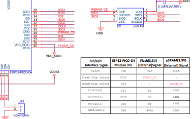
因此，需使用串口U1（U0用作Serial用于调试），或使用软件串口进行通信。

使用软件串口通信时，建议波特率为9600。当波特率较高时，（猜测是软件串口的原因，或是PCB绘制对信号产生影响）使用空闲中断接收，可能导致主机接收信息不完整（发现此现象时波特率57600，接收最长数据基本在40左右）。

使用ESP32的定时器中断时，中断处理函数不能进行阻塞操作（**包括```Serial.print```等**），且代码执行时间过长也可能导致错误。因此中断触发时，可使用一个flag记录此状态，并在```loop()```中进行处理。

ESP32中的String不同于std::string，是Arduino提供的一个类。

## 🗑️ 废案
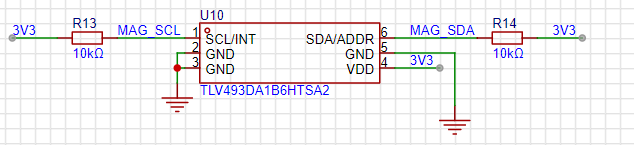
PCB上添加了TLV493D-A1B6 3轴磁力计模块，通过I2C进行数据读取，用于指示当前方向。
但由于地磁场强度一般在25-65uT之间，而该模块最小分辨率为98uT，因此该模块无法用于指示方向（模块本身功能实现正常）。
后续若希望实现实时方向指示，建议使用IMU。
但~~代码写都写了~~，并且当前此模块在STM32的驱动较少，因此本文仍列出一部分教程（正好如果使用IMU，软件I2C估计也会用到）。

### 📨 软件I2C
由于STM32的硬件I2C存在一些问题，因此使用GPIO模拟I2C时序。
I2C是一种半双工通信，时钟由主机生成。当总线上存在多个主从设备时，为防止不同设备输出不同导致短路，IO应设置为**开漏输出**并连接上拉电阻。

总线空闲时默认为高电平。主机准备通信时，先拉低SDA，后拉低SCL，表示开始传输数据。
每次传输数据一般为8bit，且在SCL的**上升沿**对SDA进行采样。若发送设备地址，多数设备的地址为7位，且用地址之后的一位表示读写（写=0，读=1）。
发送完8bit之后，从机将会在SDA输出低电平表示应答。因此完成一个字节的发送之后，主机的SDA需要调整为输入模式，并在产生一个SCL上升沿之后等待SDA的下降沿。同样地，若主机读取完从机发送的一字节数据之后，主机也需要产生一个SDA下降沿表示应答（SCL始终由主机控制）。
完成通信后，或是一段时间内未收到从机应答，需要结束通信，即先拉高SCL，后拉高SDA。
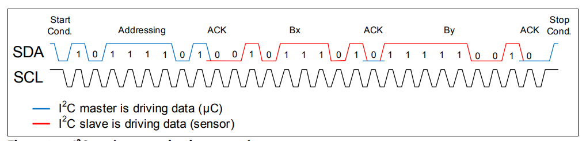
上图是TLV493D手册给出的I2C通信示例。主机发送起始信号后，开始发送从机的地址，表示读取从机寄存器的内容。
发送完成后从机应答，并开始发送寄存器内容。每发送一字节，主机均进行一次应答。
从机发送2字节后，主机发送结束信号，终止通信。

### 🧲 磁力计寄存器
TLV493D有10字节的读寄存器(RR)与4字节的写寄存器(WR)，以下介绍一些比较重要的寄存器。
RR 0x07, 0x08, 0x09存放了3个固定的数据，其在出厂时已写入。对磁力计进行初始化时，需要先读取以上的内容，并将其写入到WR 0x01, 0x02, 0x03的指定位置。
在WR里还需要通过INT, FAST, LP设置模式，一般设置为主机控制模式(Master Controlled Mode)且INT=0，此时磁力计在主机发送读取信号后才会进行测量，并返回RR寄存器值。
PT为1时开启校验位，则每次发送指令时，WR的32bit之和必须为奇数（可通过P进行调整）。
在STM32内配置好要发送的内容后，便可一次将WR的4字节依次进行传输。后续可在循环中读取RR的前7字节，并进行数据解算（见手册）。

## 📄 BOM表
以下元件可在立创商城购买。
被删除的部分表示已购买，但由于机械结构或设备功能调整，最终未使用的元件。
| No. | Quantity | Comment | Designator                              | Footprint                           | Value | Manufacturer Part     | Manufacturer     | Supplier Part | LCSC Price |
|--|--|--|--|--|--|--|--|--|--|
| ~~1~~   | ~~1~~        | ~~5P排座~~    | | ~~HDR-TH_5P-P2.54-V-F~~                 |       | ~~2.54-1*5P母~~            | ~~BOOMELE(博穆精密)~~    | ~~C50950~~        | ~~0.3786~~     |
| ~~2~~   | ~~1~~        |~~电池接口~~ | ~~+~~                                       | ~~CONN-TH_2P-P2.50_HX25003-2A~~         |       | ~~ZX-XH2.54-2PZZ~~        | ~~Megastar(兆星)~~     | ~~C7429632~~      | ~~0.0374~~     |
| 3   | 1        | | C1                                      | C0402                               | 2.2uF | HGC0402R5225K160NTEJ  | Chinocera(华瓷)    | C7432763      | 0.0359     |
| 4   | 1        |         | C2                                      | C0402                               | 10uF  | CGA0402X5R106M100GT   | HRE(芯声)          | C6119763      | 0.0395     |
| 5   | 3        |         | C3,C4,C22                               | C0402                               | 10uF  | CL05A106MQ5NUNC       | SAMSUNG(三星)      | C15525        | 0.0287     |
| 6   | 10       |         | C12,C13,C16,C17,C18,C19,C20,C21,C25,C26 | C0402                               | 100nF | CL05B104KO5NNNC       | SAMSUNG(三星)      | C1525         | 0.0074     |
| 7   | 2        |         | C14,C15                                 | C0402                               | 20pF  | 0402CG200J500NT       | FH(风华)           | C1554         | 0.0055     |
| 8   | 5        | 红色LED   | CHRG,FULL,GPS,ON,WIFI                   | LED0603-RD                          |       | KT-0603R              | KENTO            | C2286         | 0.0352     |
| 9   | 1        | 4P排针    |                                         | HDR-TH_4P-P2.54-V-M                 |       |                       |                  | C492403       | 0.1378     |
| 10  | 2        | 1个在键盘上  | FPC1,FPC2                               | FPC-SMD_P0.50-8P_FGS-XJ-H2.0        |       | AFC01-S08FCA-00       | JS(钜硕电子)         | C262657       | 0.689      |
| 11  | 1        |         | JP1                                     | RF-SMD_FRF05002-JSS103M             |       | U.FL-R-SMT-1(80)      | HRS(广濑)          | C88374        | 0.5326     |
| 12  | 2        |         | Q1,Q2                                   | SOT-23-3_L2.9-W1.6-P1.90-LS2.8-BR   |       | S8050                 | Hottech(合科泰)     | C181158       | 0.0323     |
| 13  | 8        |         | R1,R2,R7,R10,R11,R12,R16,R17            | R0402                               | 180Ω  | 0402WGF1800TCE        | UNI-ROYAL(厚声)    | C38941        | 0.0033     |
| 14  | 1        |         | R3                                      | R0402                               | 2.7kΩ | 0402WGF2701TCE        | UNI-ROYAL(厚声)    | C25885        | 0.0031     |
| 15  | 2        |         | R4,R5                                   | R0402                               | 56kΩ  | RC0402FR-0756KL       | YAGEO(国巨)        | C114756       | 0.004      |
| 16  | 6        |         | R6,R8,R9,R13,R14,R15                    | R0603                               | 10kΩ  | 0603WAF1002T5E        | UNI-ROYAL(厚声)    | C25804        | 0.0055     |
| 17  | 13       | 12个在键盘上 | RESET                                   | SW-SMD_L3.9-W3.0-P4.45              |       | TS-1088-AR02016       | XUNPU(讯普)        | C720477       | 0.2578     |
| 18  | 1        |         | SW1                                     | SW-TH_K3-1296S-E1                   |       | K3-1296S-E1           | 韩国韩荣             | C128955       | 0.5574     |
| 19  | 1        | 8P排座    | TFT                                     | HDR-TH_8P-P2.54-V-F-1               |       | 2.54-1*8P母环保          | BOOMELE(博穆精密)    | C27438        | 0.4554     |
| 20  | 1        |         | U1                                      | LQFP-64_L10.0-W10.0-P0.50-LS12.0-BL |       | STM32F103RCT6         | ST(意法半导体)        | C8323         | 10.43      |
| 21  | 1        |         | U3                                      | SOT-223_L6.5-W3.5-P2.30-LS7.0-BR    |       | BL9110-330BPFB        | BL(上海贝岭)         | C169246       | 1.0205     |
| 22  | 1        |         | U4                                      | SOT-23-6_L2.9-W1.6-P0.95-LS2.8-BL   |       | LGS4084HB6            | Legend-Si(棱晶半导体) | C5299901      | 0.5683     |
| 23  | 1        |         | U5                                      | SOT-23-5_L3.0-W1.7-P0.95-LS2.8-BR   |       | LMV321IDBVR           | TI(德州仪器)         | C7972         | 0.5085     |
| 24  | 1        |         | U6                                      | SOIC-8_L5.3-W5.3-P1.27-LS8.0-BL     |       | W25Q32JVSSIQ          | WINBOND(华邦)      | C179173       | 1.7422     |
| 25  | 1        |         | U7                                      | ESP32-PICO-D4_lengthen              | -     | ESP32-PICO-D4         | ESPRESSIF(乐鑫)    | C193707       | 29.98      |
| 26  | 1        |         | U9                                      | ESOP-10_L4.9-W3.9-P1.00-LS6.0-BL-EP |       | CH340K                | WCH(南京沁恒)        | C18208922     | 3.59       |
| ~~27~~  | ~~1~~        |         | ~~U10~~                                     | ~~SOP-6_L3.0-W1.5-P0.95-LS2.5-BR~~      |       | ~~TLV493DA1B6HTSA2~~      | ~~Infineon(英飞凌)~~    | ~~C126688~~       | ~~6.16~~       |
| 28  | 1        |         | USB2                                    | USB-C-SMD_TYPE-C-6PIN-2MD-073       |       | TYPE-C 16PIN 2MD(073) | SHOU HAN(首韩)     | C2765186      | 0.3417     |
| 29  | 1        |         | X1                                      | CRYSTAL-SMD_L11.5-W4.8-LS12.7       | 8MHz  | X49SM8MSD2SC          | YXC(扬兴晶振)        | C12674        | 0.4885     |

以下价格为本人实付款。
FFC软排线 http://e.tb.cn/h.gKRIjoYMc3sGwWq?tk=RwYv3hsiOzK 1.50元/10条 [8P 0.5mm间距 6cm]
GPS模块 http://e.tb.cn/h.gK3eTJlckCmSD15?tk=YSoj3hs84QF 16.01元
TFT屏幕 http://e.tb.cn/h.gsNdBHfZl7LqEyc?tk=Va3W3RBWIh2 17.50元 [1.4寸-8针模块 焊接排针]
GPS陶瓷天线 http://e.tb.cn/h.gKGVyw7I6Xk4Haq?tk=9xjv3hsRRnL 6.79元 [20\*6mm 1代IPEX 线长5mm]
锂电池 http://e.tb.cn/h.gI9JvxiTkvpHdUu?tk=kVCw3RB2Ard  11.16元 [白色 700毫安/603040]
魔术贴扎带 http://e.tb.cn/h.gI9JvfrN0oObXGf?tk=TqVp3RBdNs0 0.73元/2条 [2.5cm\*20cm]
备用焊接天线 http://e.tb.cn/h.gIKvwdTy4jqfKhm?tk=LXVf3RBdEWG 0.73元 [IPEX1代 12cm]

## 💸 费用
元器件总价122.18元（包括非立创商城购买的显示屏、电池等，立创商城运费按7元计算）。
事实上，由于立创商城购买元件有最小数量限制，实际需要180.97元。
3D打印件在嘉立创3D打印价格为29.25元（X树脂 72小时，包括4元运费）。

通过回收以往使用过的元器件，并使用嘉立创免费PCB打样，本次实际成本为**45.54元**（**105.72元通过星火计划减免**）。

## 📚 参考资料
[1]一节小号锂电池集成板 https://oshwhub.com/roudragon/c706596_-sheng-ya-dc-dc-xin-pian-fang-an-yan-zheng-ban-xiao-feng-zhuang-1_2024-04-22_14-30-16
[2]南工骁鹰电控框架开源&2022步兵电控开源 https://github.com/KGYu0293/Infantry2022V2_mecanum_f407
[3]STM32 + SPI + W25Qxx 外部 FLASH（掉电保存） https://blog.csdn.net/m0_52864526/article/details/133607655#W25Qxx_1
[4]stm32 使用hal+spi驱动st7789中景园屏幕 https://blog.csdn.net/my_id_kt/article/details/124178946
[5]坐标系转换 Python 实现 https://zhuanlan.zhihu.com/p/693603193# Cycling_Assistance-
